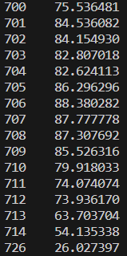

## 專案介紹
主要是想透過該專案來了解量化交易相關的知識。

## 資料取得
這裡的資料取得透過FinMind的API，因為FinMind已經整理了許多不同網站的股價資訊，可以節省很多時間。
因為每小時限制600筆requests，考慮使用定時的方式執行。

## 資料儲存
因為資料很多很大，所以使用資料庫，現在以Sqlite進行測試，後續應該會搬移到其他資料庫上。

## 目前已有功能
1. 定時向API發送request請求資料
2. 可以簡單透過每日股價來計算單支股票的RSI

